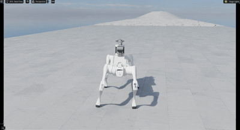
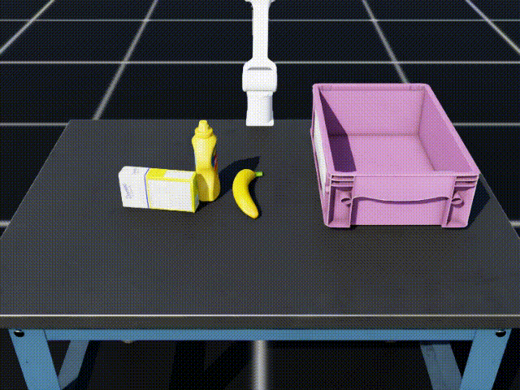

## 1. Example Code Guide

This document provides a minimal end-to-end example for training, evaluating, and submitting a policy.

## 2. RL for Locomotion

### 2.1 Train a PPO Policy (Example)

The baseline workflow references: https://github.com/fan-ziqi/robot_lab

Run the following command from the repository root:

```bash
python scripts/rsl_rl/train.py --task ATEC-Isaac-Velocity-Flat-Unitree-B2-v0 --headless --video
```

On an **NVIDIA RTX 5090**, this example typically takes around **90 minutes**.

Actual training time depends on driver/runtime version, CPU performance, and current GPU load.

### 2.2 Evaluate the Trained Policy

After training, evaluate with:

```bash
python scripts/rsl_rl/play.py --task ATEC-Isaac-Velocity-Flat-Unitree-B2-v0
```

This loads the trained checkpoint and runs rollout in the same task setting.

### 2.3 Test Locally

The file `demo/solution.py` is the only entrance for locally testing and online submission.
Use the test command:

```bash
cd ATEC2026_Simulation_Challenge
python scripts/play_atec_task.py --task ATEC-TaskA-B2Piper --enable_cameras
```

Notes:

- `--task` selects the arena and robot. See the Environment Matrix in `readme.md`.
- Use `--debug` to print runtime status and score.

Pretrained baseline checkpoint:

- `./atec_robot_model/baseline/unitree_b2_flat/policy.pt`
This checkpoint path can be modified in `demo/solution.py`.



### 2.4 B2+Piper (Quadruped with Arm) Locomotion

Train a velocity-command-following policy for B2 with a Piper arm mounted.
The arm joints are perturbed during training to make the locomotion policy robust.

**Flat terrain (plane):**

```bash
# GPU training (recommended, ~15-20 min on V100S):
python scripts/rsl_rl/train.py \
  --task ATEC-Isaac-Velocity-Flat-Unitree-B2-Piper-v0 \
  --num_envs 4096 \
  --max_iterations 10000 \
  --headless

# CPU training (fallback, ~17 hours):
CUDA_VISIBLE_DEVICES="" python scripts/rsl_rl/train.py \
  --task ATEC-Isaac-Velocity-Flat-Unitree-B2-Piper-v0 \
  --num_envs 512 \
  --max_iterations 10000 \
  --headless \
  --device cpu
```

**Rough terrain:**

```bash
python scripts/rsl_rl/train.py \
  --task ATEC-Isaac-Velocity-Rough-Unitree-B2-Piper-v0 \
  --num_envs 4096 \
  --max_iterations 20000 \
  --headless
```

**With video recording:**

```bash
python scripts/rsl_rl/train.py \
  --task ATEC-Isaac-Velocity-Flat-Unitree-B2-Piper-v0 \
  --num_envs 4096 \
  --max_iterations 10000 \
  --headless \
  --video --video_length 200 --video_interval 2000
```

Videos are saved under `logs/rsl_rl/unitree_b2_piper_flat/<timestamp>/videos/train/`.

| Task ID | Robot | Terrain | PPO Iterations |
|---------|-------|---------|---------------|
| `ATEC-Isaac-Velocity-Flat-Unitree-B2-Piper-v0` | B2+Piper | Flat | 5000 (default) |
| `ATEC-Isaac-Velocity-Rough-Unitree-B2-Piper-v0` | B2+Piper | Rough | 20000 (default) |

## 3. IL for Manipoulation

This section follows the core idea of ACT (Action Chunking with Transformers).

Reference implementation: https://github.com/tonyzhaozh/act

### 3.1 Collect Demonstrations

Collect expert trajectories for Task E:

```bash
python scripts/act/collect_demos_task_e.py --pick_objects 3 --num_demos 100 --headless --enable_cameras --save_images
```

Filter out near-zero actions from the collected dataset:

```bash
python scripts/act/filter_demos.py \
	--input datasets/atec_task_e/trajectory.hdf5 \
	--output datasets/atec_task_e/trajectory_filtered.hdf5 \
	--threshold 0.001
```

### 3.2 Train ACT Policy

Run ACT baseline training from the `scripts/act` directory:

```bash
cd scripts/act
bash baseline.sh
```

### 3.3 Run the Trained Policy

Use the test command:

```bash
python scripts/play_atec_task.py --task ATEC-TaskE-Piper --enable_cameras
```

Note: `./atec_robot_model/baseline/act/policy.pt` is the provided baseline checkpoint. You can replace it with your own trained policy path in `demo/solution`.


